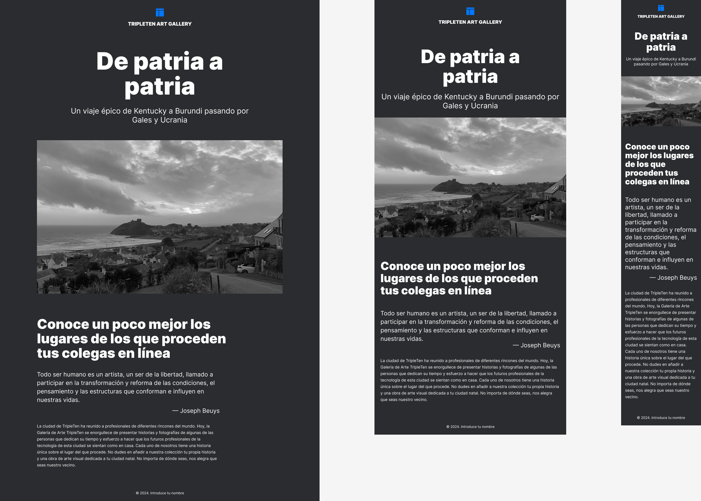

# Triple Ten Art Gallery

## Descripción

Triple Ten Art Gallery es un proyecto de una galería de arte en línea que muestra obras de artistas de diferentes rincones del mundo. La página incluye un encabezado, una sección introductoria y un pie de página, con un diseño responsivo para adaptarse a diferentes tamaños de pantalla.

## Tecnologías Utilizadas

- **HTML5**: Estructura del contenido de la página.
- **CSS3**: Estilos y diseño de la página. Utiliza:
  - **Normalize.css**: Para normalizar los estilos en diferentes navegadores.
  - **@font-face**: Para la carga de fuentes personalizadas.


## Estructura del Proyecto

El proyecto está organizado de la siguiente manera:

```plaintext
Triple Ten Art Gallery/
  ├── images/                      <- todas las imágenes
  ├── pages/
  │   └── index.css                <- estilos CSS de la página principal
  ├── blocks/                      <- archivos CSS específicos de bloques
  │   ├── page.css
  │   ├── header.css
  │   ├── intro.css
  │   └── footer.css
  ├── vendor/                      <- normalize.css
  │   ├── fonts.css
  │   ├── normalize.css
  ├── favicon.ico
  ├── index.html                   <- archivo HTML principal
  ├── README.md                    <- este archivo
  ├── .editorconfig                <- configuración de editor
  └── .gitignore                   <- archivos a ignorar en git

git clone git@github.com:luuzuriaga/web_project_homeland.git


